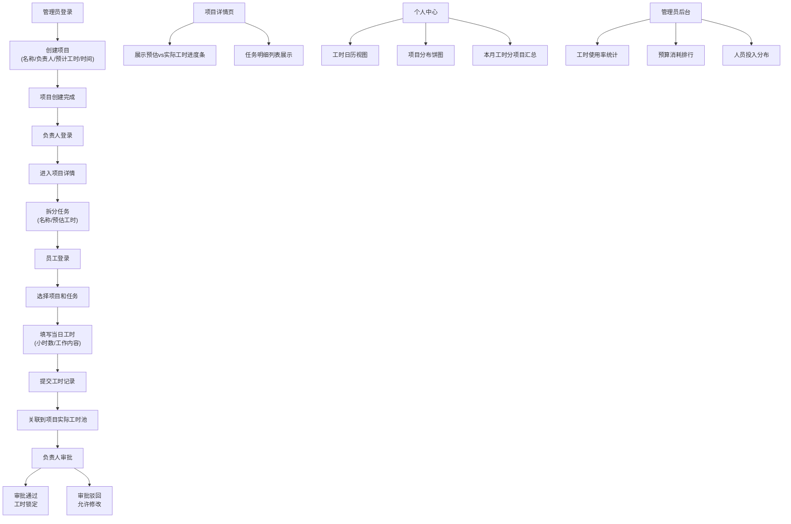

## 1. 产品概述

项目制工时管理系统是一款面向企业的全栈工时追踪与管理平台，解决项目工时分配、任务拆分、工时填报与审批的全流程管理问题。系统支持管理员、项目负责人、普通员工三种角色，实现从项目创建到工时统计分析的完整闭环。

- **主要用途**：项目工时规划与分配、员工日常工时填报、工时审批与锁定、多维度工时统计分析
- **目标用户**：企业管理员、项目经理/负责人、普通员工
- **核心价值**：可视化项目工时消耗、精确核算人力成本、提升团队工作效率

## 2. 核心功能

### 2.1 用户角色

| 角色 | 登录方式 | 核心权限 |
|------|----------|----------|
| 管理员 | 账号密码登录 | 创建/管理项目、查看所有项目统计、工时使用率分析、预算消耗监控、人员投入排行 |
| 项目负责人 | 账号密码登录 | 拆分项目任务、查看成员工时、审批工时、项目进度监控 |
| 普通员工 | 账号密码登录 | 选择参与的项目与任务、填写每日工时、查看个人工时日历与统计 |

### 2.2 功能模块

1. **登录页**：用户认证、角色识别、权限路由
2. **管理员后台**：项目管理、项目创建、工时使用率统计、预算消耗分析、人员投入排行
3. **项目列表页**：所有项目概览、项目状态筛选、进入项目详情
4. **项目详情页**：项目基本信息、工时进度条、任务拆分管理、任务工时明细、成员工时审批
5. **工时填报页**：选择项目与任务、填写当日工时与工作内容、工时提交
6. **个人中心**：工时日历视图、项目工时饼图、本月工时分项目汇总统计

### 2.3 页面详情

| 页面名称 | 模块名称 | 功能描述 |
|----------|----------|----------|
| 登录页 | 登录表单 | 用户名/密码输入、登录验证、错误提示 |
| 管理员后台 | 项目创建表单 | 项目名称、负责人、预计工时、起止时间选择 |
| 管理员后台 | 项目列表管理 | 项目卡片展示、编辑/删除操作、状态标签 |
| 管理员后台 | 统计看板 | 工时使用率排行、预算消耗进度条、人员投入分布图 |
| 项目列表页 | 项目卡片列表 | 项目名称、负责人、进度百分比、起止时间展示 |
| 项目详情页 | 进度概览 | 预估工时vs实际工时对比进度条、百分比展示 |
| 项目详情页 | 任务管理 | 新增任务、任务列表、任务预估工时 |
| 项目详情页 | 工时明细 | 按任务分组展示工时记录、审批操作按钮 |
| 项目详情页 | 成员工时概览 | 各成员已填工时汇总、审批状态 |
| 工时填报页 | 项目/任务选择器 | 下拉选择参与的项目和对应任务 |
| 工时填报页 | 工时表单 | 工时小时数输入、工作内容文本域、日期选择 |
| 工时填报页 | 历史记录列表 | 近期填写的工时记录展示 |
| 个人中心 | 工时日历 | 日历视图展示每日工时填写状态 |
| 个人中心 | 项目分布饼图 | 各项目工时占比可视化图表 |
| 个人中心 | 月度统计 | 本月工时按项目汇总表格、总计展示 |

## 3. 核心流程

## 4. 用户界面设计

### 4.1 设计风格

- **主色调**：深蓝色系 (#1E3A8A) 作为主色，代表专业与可靠；搭配青绿色 (#0D9488) 作为进度与成功状态的强调色
- **辅助色**：橙色 (#F97316) 用于警告和待审批状态，灰色系 (#64748B) 用于次要信息
- **按钮风格**：圆角中等 (8px)，悬停时有微妙的阴影加深和颜色微变，按下有轻微内缩效果
- **字体**：标题使用 "Noto Sans SC" 700权重，正文使用 "Noto Sans SC" 400权重，数字和统计数据使用等宽字体 "JetBrains Mono"
- **布局风格**：左侧导航栏 + 右侧内容区的经典布局，卡片式模块划分，内容区采用网格布局
- **图标风格**：使用线性风格图标，统一16px/20px尺寸，颜色与文字层级保持一致

### 4.2 页面设计概述

| 页面名称 | 模块名称 | UI元素 |
|----------|----------|--------|
| 登录页 | 登录卡片 | 居中卡片布局，左侧品牌展示区(渐变背景+logo)，右侧表单区(输入框+登录按钮)，底部忘记密码链接 |
| 管理员后台 | 统计看板 | 顶部统计卡片行(4个关键指标)，中部项目列表，底部三栏统计图表(使用率排行+预算进度+人员分布) |
| 项目详情页 | 进度概览 | 大尺寸双色进度条(蓝色预估+绿色实际)，百分比数字叠加，关键指标数值卡片 |
| 项目详情页 | 任务列表 | 可折叠任务卡片，每个卡片内含工时明细表格，审批按钮组使用胶囊样式 |
| 工时填报页 | 表单区 | 左右两栏布局，左栏表单(项目/任务级联选择、工时滑块输入、内容文本域)，右栏今日已填工时汇总 |
| 个人中心 | 数据可视化区 | 上部日历视图(日期格子填充颜色表示工时多少)，下部左右分栏(饼图+统计表) |
| 个人中心 | 月度统计 | 分组表格，每行带有项目色条，末尾行加粗显示总计 |

### 4.3 响应式设计

- **桌面优先**：以1440px宽度为基准设计，栅格系统使用12列布局
- **平板适配**：在1024px断点将左侧导航栏收起为图标模式，内容区调整为单列布局
- **移动端**：在768px断点将导航改为底部Tab栏，卡片和表格改为单列堆叠，数据图表自适应缩小

### 4.4 动效与交互

- 页面加载时采用从上到下的渐入动画，内容区块依次延迟50ms显现
- 进度条使用从左到右的填充动画，时长600ms，缓动函数ease-out
- 卡片悬停时有轻微上移(translateY(-2px))和阴影加深效果
- 审批通过/驳回操作有成功/失败的图标动画反馈
- 饼图扇区悬停时有放大高亮效果
- 表单输入框聚焦时有边框颜色过渡和轻微的缩放效果
