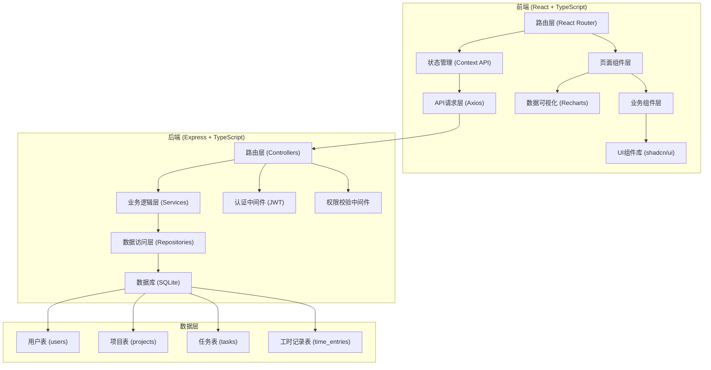
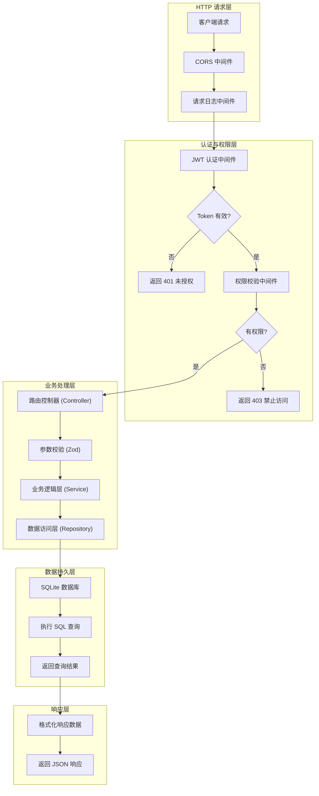
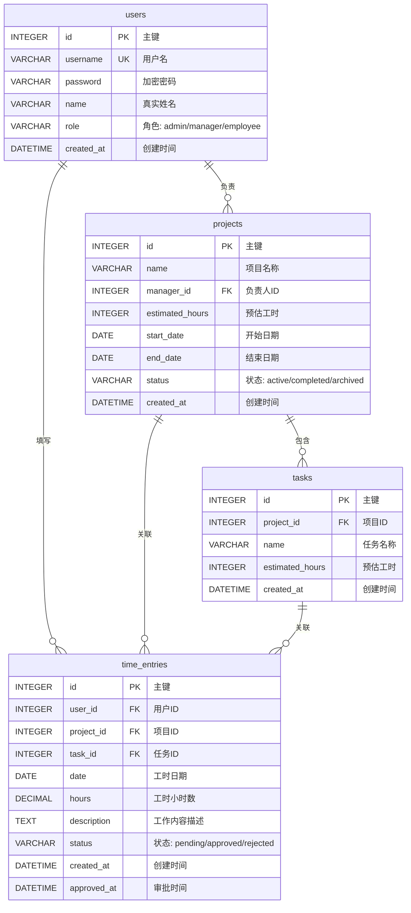

## 1. 架构设计



## 2. 技术描述

- **前端技术栈**：
  - 框架：React 18 + TypeScript
  - 构建工具：Vite 5
  - 样式方案：TailwindCSS 3 + CSS Variables
  - 路由管理：React Router v6
  - 状态管理：React Context API + useReducer
  - HTTP客户端：Axios
  - UI组件库：shadcn/ui (基于Radix UI)
  - 数据可视化：Recharts
  - 图标：Lucide React
  - 表单处理：React Hook Form + Zod

- **后端技术栈**：
  - 框架：Express 4 + TypeScript
  - 数据库：SQLite 3 (通过 better-sqlite3)
  - ORM/查询构建：无原生SQL (轻量级方案)
  - 认证：JWT (jsonwebtoken)
  - 密码加密：bcryptjs
  - 请求校验：Zod
  - CORS处理：cors中间件

- **项目结构**：
  - `/frontend` - 前端应用目录
  - `/backend` - 后端API目录
  - 根目录包含concurrently配置用于同时启动前后端

## 3. 路由定义

| 前端路由 | 页面组件 | 权限要求 | 说明 |
|----------|----------|----------|------|
| `/login` | LoginPage | 公开 | 登录页面 |
| `/dashboard` | DashboardPage | 管理员 | 管理员后台统计看板 |
| `/projects` | ProjectListPage | 所有登录用户 | 项目列表页 |
| `/projects/:id` | ProjectDetailPage | 负责人/管理员 | 项目详情页 |
| `/timesheet` | TimesheetPage | 所有登录用户 | 工时填报页 |
| `/profile` | ProfilePage | 所有登录用户 | 个人中心 |

| 后端API路由 | 方法 | 权限 | 说明 |
|-------------|------|------|------|
| `/api/auth/login` | POST | 公开 | 用户登录，返回JWT |
| `/api/users` | GET | 管理员 | 获取所有用户列表 |
| `/api/projects` | GET | 所有登录用户 | 获取项目列表 |
| `/api/projects` | POST | 管理员 | 创建新项目 |
| `/api/projects/:id` | GET | 所有登录用户 | 获取单个项目详情 |
| `/api/projects/:id` | PUT | 管理员 | 更新项目信息 |
| `/api/projects/:id` | DELETE | 管理员 | 删除项目 |
| `/api/projects/:id/tasks` | POST | 负责人/管理员 | 为项目添加任务 |
| `/api/projects/:id/tasks/:taskId` | PUT | 负责人/管理员 | 更新任务 |
| `/api/projects/:id/tasks/:taskId` | DELETE | 负责人/管理员 | 删除任务 |
| `/api/time-entries` | GET | 所有登录用户 | 获取工时记录列表 |
| `/api/time-entries` | POST | 所有登录用户 | 创建工时记录 |
| `/api/time-entries/:id` | PUT | 员工本人 | 更新工时记录 |
| `/api/time-entries/:id/approve` | POST | 负责人/管理员 | 审批通过工时 |
| `/api/time-entries/:id/reject` | POST | 负责人/管理员 | 驳回工时 |
| `/api/stats/projects` | GET | 管理员 | 获取项目统计数据 |
| `/api/stats/personal` | GET | 所有登录用户 | 获取个人统计数据 |
| `/api/stats/projects/:id` | GET | 负责人/管理员 | 获取单个项目统计 |

## 4. API 类型定义

```typescript
// 用户相关
interface User {
  id: number;
  username: string;
  name: string;
  role: 'admin' | 'manager' | 'employee';
  createdAt: string;
}

interface LoginRequest {
  username: string;
  password: string;
}

interface LoginResponse {
  token: string;
  user: User;
}

// 项目相关
interface Project {
  id: number;
  name: string;
  managerId: number;
  managerName: string;
  estimatedHours: number;
  startDate: string;
  endDate: string;
  status: 'active' | 'completed' | 'archived';
  actualHours: number;
  createdAt: string;
}

interface CreateProjectRequest {
  name: string;
  managerId: number;
  estimatedHours: number;
  startDate: string;
  endDate: string;
}

// 任务相关
interface Task {
  id: number;
  projectId: number;
  name: string;
  estimatedHours: number;
  actualHours: number;
  createdAt: string;
}

interface CreateTaskRequest {
  name: string;
  estimatedHours: number;
}

// 工时记录相关
interface TimeEntry {
  id: number;
  userId: number;
  userName: string;
  projectId: number;
  projectName: string;
  taskId: number;
  taskName: string;
  date: string;
  hours: number;
  description: string;
  status: 'pending' | 'approved' | 'rejected';
  createdAt: string;
  approvedAt?: string;
}

interface CreateTimeEntryRequest {
  projectId: number;
  taskId: number;
  date: string;
  hours: number;
  description: string;
}

// 统计相关
interface ProjectStats {
  projectId: number;
  projectName: string;
  estimatedHours: number;
  actualHours: number;
  usageRate: number;
  budgetUsed: number;
  memberCount: number;
}

interface PersonalStats {
  totalHours: number;
  byProject: Array<{
    projectId: number;
    projectName: string;
    hours: number;
    percentage: number;
  }>;
  calendarData: Array<{
    date: string;
    hours: number;
  }>;
}
```

## 5. 服务器架构图



## 6. 数据模型

### 6.1 ER 图



### 6.2 DDL 语句

```sql
-- 用户表
CREATE TABLE users (
    id INTEGER PRIMARY KEY AUTOINCREMENT,
    username VARCHAR(50) UNIQUE NOT NULL,
    password VARCHAR(255) NOT NULL,
    name VARCHAR(100) NOT NULL,
    role VARCHAR(20) NOT NULL CHECK (role IN ('admin', 'manager', 'employee')),
    created_at DATETIME DEFAULT CURRENT_TIMESTAMP
);

-- 项目表
CREATE TABLE projects (
    id INTEGER PRIMARY KEY AUTOINCREMENT,
    name VARCHAR(200) NOT NULL,
    manager_id INTEGER NOT NULL,
    estimated_hours INTEGER NOT NULL,
    start_date DATE NOT NULL,
    end_date DATE NOT NULL,
    status VARCHAR(20) DEFAULT 'active' CHECK (status IN ('active', 'completed', 'archived')),
    created_at DATETIME DEFAULT CURRENT_TIMESTAMP,
    FOREIGN KEY (manager_id) REFERENCES users(id)
);

-- 任务表
CREATE TABLE tasks (
    id INTEGER PRIMARY KEY AUTOINCREMENT,
    project_id INTEGER NOT NULL,
    name VARCHAR(200) NOT NULL,
    estimated_hours INTEGER NOT NULL,
    created_at DATETIME DEFAULT CURRENT_TIMESTAMP,
    FOREIGN KEY (project_id) REFERENCES projects(id) ON DELETE CASCADE
);

-- 工时记录表
CREATE TABLE time_entries (
    id INTEGER PRIMARY KEY AUTOINCREMENT,
    user_id INTEGER NOT NULL,
    project_id INTEGER NOT NULL,
    task_id INTEGER NOT NULL,
    date DATE NOT NULL,
    hours DECIMAL(4,1) NOT NULL CHECK (hours > 0 AND hours <= 24),
    description TEXT,
    status VARCHAR(20) DEFAULT 'pending' CHECK (status IN ('pending', 'approved', 'rejected')),
    created_at DATETIME DEFAULT CURRENT_TIMESTAMP,
    approved_at DATETIME,
    FOREIGN KEY (user_id) REFERENCES users(id),
    FOREIGN KEY (project_id) REFERENCES projects(id) ON DELETE CASCADE,
    FOREIGN KEY (task_id) REFERENCES tasks(id) ON DELETE CASCADE
);

-- 索引
CREATE INDEX idx_time_entries_user_date ON time_entries(user_id, date);
CREATE INDEX idx_time_entries_project ON time_entries(project_id);
CREATE INDEX idx_time_entries_task ON time_entries(task_id);
CREATE INDEX idx_projects_manager ON projects(manager_id);
CREATE INDEX idx_tasks_project ON tasks(project_id);

-- 初始化测试数据
INSERT INTO users (username, password, name, role) VALUES 
('admin', '$2a$10$...', '系统管理员', 'admin'),
('manager1', '$2a$10$...', '张经理', 'manager'),
('employee1', '$2a$10$...', '李员工', 'employee'),
('employee2', '$2a$10$...', '王员工', 'employee');
```

### 6.3 初始数据

系统将预置以下测试账号（密码均为 `123456`）：

| 用户名 | 密码 | 角色 | 姓名 |
|--------|------|------|------|
| admin | 123456 | 管理员 | 系统管理员 |
| manager1 | 123456 | 负责人 | 张经理 |
| employee1 | 123456 | 员工 | 李员工 |
| employee2 | 123456 | 员工 | 王员工 |

同时预置2-3个示例项目和任务，以及一些工时记录用于演示。
